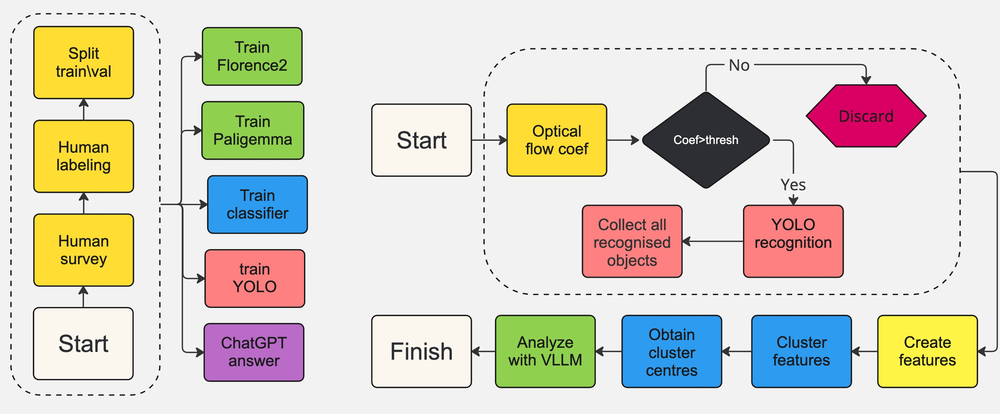

# Leveraging Visual Large Language Models and Computer Vision for Cost-Effective and Consistent Street Food Safety Assessment in Kolkata India

## Authors
[**Alexey Chernikov**](https://www.linkedin.com/in/alexey-chernikov-a739b173/)1, 
**Klaus Ackermann**1*,  
**Caitlin Brown**2,  
**Denni Tommasi**3

## Affiliations
1SoDa Labs & Department of Econometrics and Business Statistics, Monash Business School, Monash University  
2Department of Economics, Université Laval  
3Department of Economics, University of Bologna  

## Publication
**Forthcoming at AAAI 2025**

# Pipeline work demonstration
The Jupyter notebook titled "StreetFood_Evaluation.ipynb" showcases the functionality of the proposed pipeline. 
It includes a raw test video file, all the images extracted by the pipeline, and the analysis results of these images performed by our fine-tuned lightweight VLLMs.

1. For those who do not intend to set up the required virtual environment, the notebook can still be explored as it contains all outputs (both text and images) already saved. It can be opened in Google Colab or any IDE you prefer (PyCharm, etc.).

2. For replication: the notebook is fully functional and can be executed in a virtual environment by anyone who wishes to replicate the process step by step.
To launch the notebook from the command line:

    cd {PROJECT_ROOT}
    conda activate sfood
    jupyter notebook StreetFood_Evaluation.ipynb 

Virtual environment installation is described below.

Once the virtual environment is set up, you can replace the test video file with your own. 
Please note that all models were trained on data collected in Kolkata, India. 
As a result, the models' performance may vary when applied to facilities in other regions with different appearances. 
Nonetheless, given the diverse representations introduced during training, testing your own video may still be worthwhile.

# Virtual environment setup
### Recommended Installation:
To train the framework, it's advised to set up a Conda (miniconda) virtual environment using the packages listed in the "requirements.txt" file.

The total space required by the virtual environment is around 10Gb.  

    cd {PROJECT_ROOT}
    conda create -n sfood python=3.11 -y
    conda activate sfood
    pip3 install torch torchvision torchaudio  --index-url https://download.pytorch.org/whl/cu121
    conda install -y nvidia/label/cuda-12.1.0::cuda-nvcc anaconda::cuda-nvvm-dev_linux-64
    pip install -r requirements.txt --no-cache-dir

### Additional downloading
For training Paligemma and Florence-2, additional downloads of the model checkpoints from the HuggingFace servers will be required.

# Datasets
All data used to train each element of the proposed framework was collected exclusively during the project. 
Due to ethical and privacy concerns, the data is currently not shared as it is undergoing anonymization to protect the vendors from unwanted attention. 

# Training procedures
The proposed framework has several key elements, each with its own training procedure.
To train the model, you need to launch

    cd {PROJECT_ROOT}
    conda activate sfood
    python3 main.py --mode {MODE_NAME}

All the modes are described bellow. 
## Inference (surveyor) pipeline models
### YOLOv10
mode name: "train_yolo". Creates YOLOv10 classifier model

### Classifier
mode name: "train_cls". Create classifier model
mode name: "eval_cls". Evaluate classifier.

## VLLMs
### ChatGPT
SET the API_KEY first in the const.py file

mode name: "gpt_train_data". Retrieves ChatGPT replies for train images.
mode name: "gpt_test_data". Get ChatGPT replies for validation images

### Paligemma
mode name: "train_pg". Trains Paligemma model
mode name: "eval_pg". Predicts Paligemma on the test set

### Florence-2
mode name: "train_fl". Trains Florence-2.
mode name: "eval_fl". Predicts Florence-2 on the test set

### Final evaluation
mode name: "fin_eval". Evaluates the approach on Human survey vs ChatGPT vs Lightweight VLLMs.

